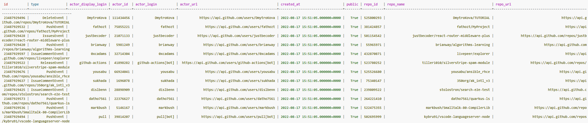

# Building a Data Modeling with Cassandra (NoSQL)
On this project I use Docker for getting start with Apache Cassandra and create database.

## Getting Started
CLI
```
cd 02-data-modeling-2
docker compose up
python -m venv ENV
source ENV/bin/activate
pip install requirements.txt
```

## etl.py
In this code, We have to create KEYSPACE first.
```
cluster = Cluster(['127.0.0.1'])
session = cluster.connect()

# Create keyspace
session.execute(
    """
    CREATE KEYSPACE IF NOT EXISTS github_events
    WITH REPLICATION = { 'class' : 'SimpleStrategy', 'replication_factor' : 1 }
    """
)
```

Next step, We set KEYSPACE
```
session.set_keyspace("github_events")
```

Then we drop if table exists, create table and insert data
```
drop_tables(session)
create_tables(session)
insert_sample_data(session)
```

We have these columns in the table
```
id, 
type, 
actor_id, 
actor_login, 
actor_display_login, 
actor_url, 
repo_id, 
repo_name, 
repo_url, 
created_at,
public
```

## Cassandra - Shell Commands
CLI
```
pip install cqlsh
```

then we can active Cassandra commands
```
cqlsh
```

Let query data
```
SELECT * FROM github_events.events;
```

